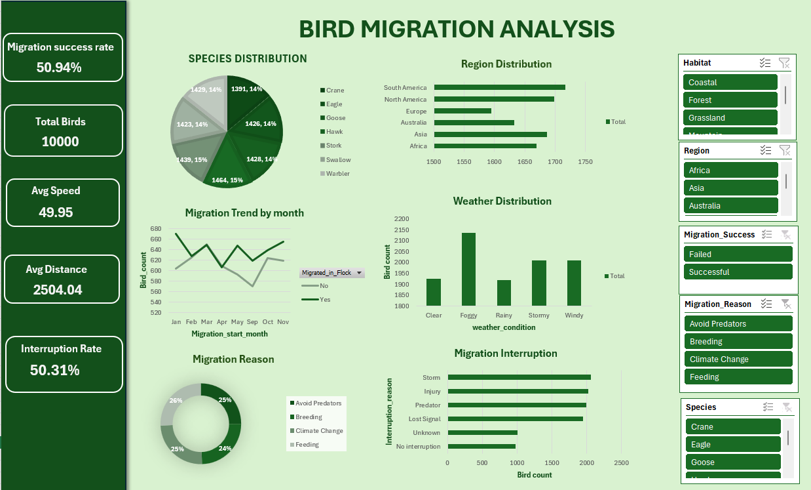

# 🐦 Bird Migration Analysis

## 📌 Project Overview

This project analyses bird migration data using Microsoft Excel to
explore migration patterns, migration success, interruptions,
weather conditions, regions, species, and migration reasons.

The project includes an interactive dashboard that allows the data
to be explored through different dimensions and key migration metrics.

## 📊 Dataset

**Dataset:** Bird Migration Dataset

- **Records:** 10,000
- **Columns:** 42

The dataset contains bird migration records along with environmental,
geographical, and tracking information.

Some of the key variables include:

- Species
- Region
- Habitat
- Weather Condition
- Migration Reason
- Flight Distance
- Flight Duration
- Average Speed
- Migration Start Month
- Migration Interrupted
- Interrupted Reason
- Migration Success

## 🛠️ Tools Used

- Microsoft Excel
- Power Query
- Pivot Tables
- Data Visualization

## 🧹 Data Cleaning & Preparation

The dataset was imported into Power Query for preparation.

The main steps included:

- Checking and handling missing values
- Replacing null values in the `Interrupted_Reason` field
- Removing unnecessary columns
- Loading the cleaned data into Excel
- Creating Pivot Tables for analysis and dashboard development

## 📈 Analysis

The project explores:

- Species distribution
- Region-wise migration
- Migration trends by month
- Weather distribution
- Migration reason distribution
- Migration interruptions
- Migration success

Different visualizations were used to communicate these patterns,
including pie charts, donut charts, line charts, column charts,
and bar charts.

## 📊 Dashboard

The interactive dashboard provides a visual summary of the key
migration metrics and allows different aspects of the dataset
to be explored.

## 🔍 Key Insights

- **Hawk** was identified as the species with the highest migration activity.
- **Avoiding predators** was the main reported migration reason.
- **South America** recorded the largest migration activity.
- **Stork** covered the maximum distance and recorded the highest speed.
- **Warbler** had the largest number of successful migrations.
- **Storms** were the main reported reason for migration interruption.
- **Foggy weather** recorded the highest migration activity.

## 💡 What I Learned

This project helped me gain practical experience in:

- Data cleaning and preparation
- Exploring data using Pivot Tables
- Selecting appropriate visualizations
- Building an interactive Excel dashboard
- Identifying patterns and summarizing findings
- Communicating data-driven insights

Most importantly, I learned that data analysis is not just about
creating charts, but about understanding the data and using
visualizations to communicate meaningful patterns.

